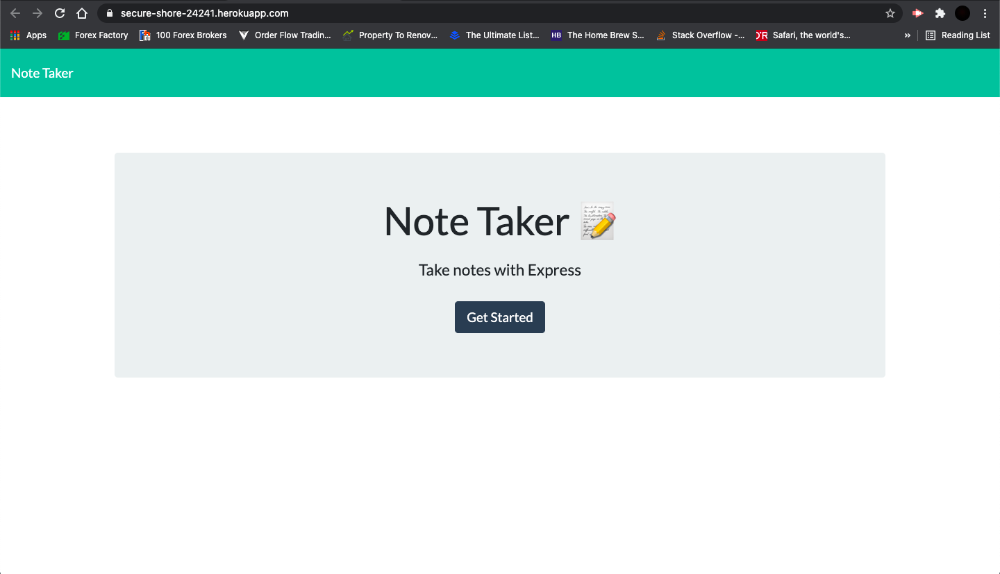
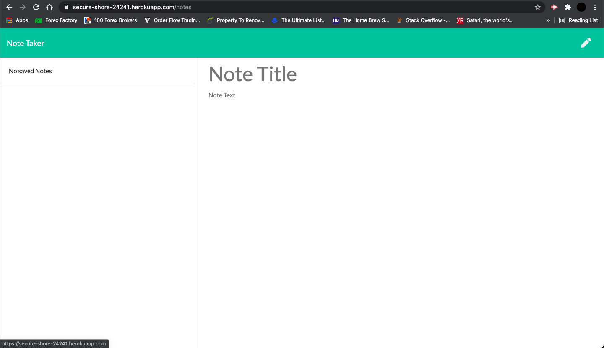
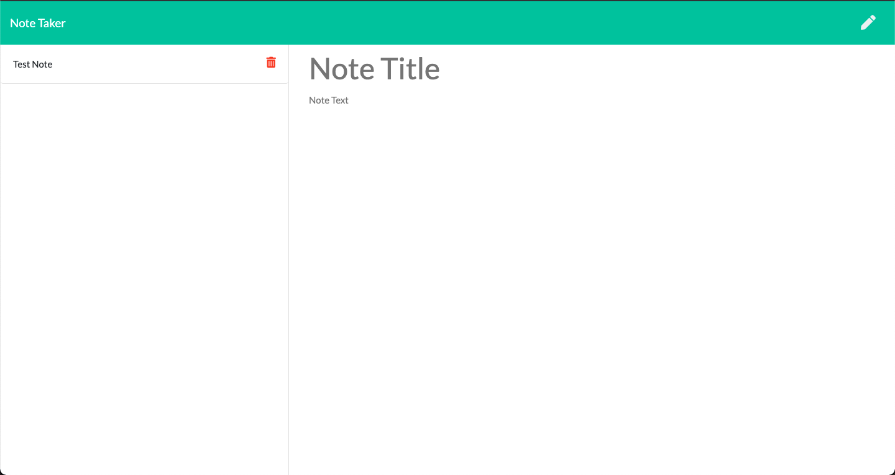

# Note Taker

## Description

This application serves the front-end to save, retrieve and delete notes from the db.json database file. Routes also have been set up to render the relevant HTML page on page load and on click onto the 'Get Started' button.

## What I have Done

- [x] Added a server setup to use express and listen on the relevant port
- [x] Added scripts to the package.json file to run the application both as a user and a developer
- [x] Set up HTML routes to render the index and notes pages
- [x] Set up API routes to serve the relevant GET, POST, and DELETE requests to retrieve, add and remove notes
- [x] Used the UUID package to generate unique IDs for each note

## Link to GitHub repository

https://github.com/ivnkris/note-taker

## Link to Deployed Application

https://secure-shore-24241.herokuapp.com/

## Contributions

Post a pull request on GitHub

## Screenshots

